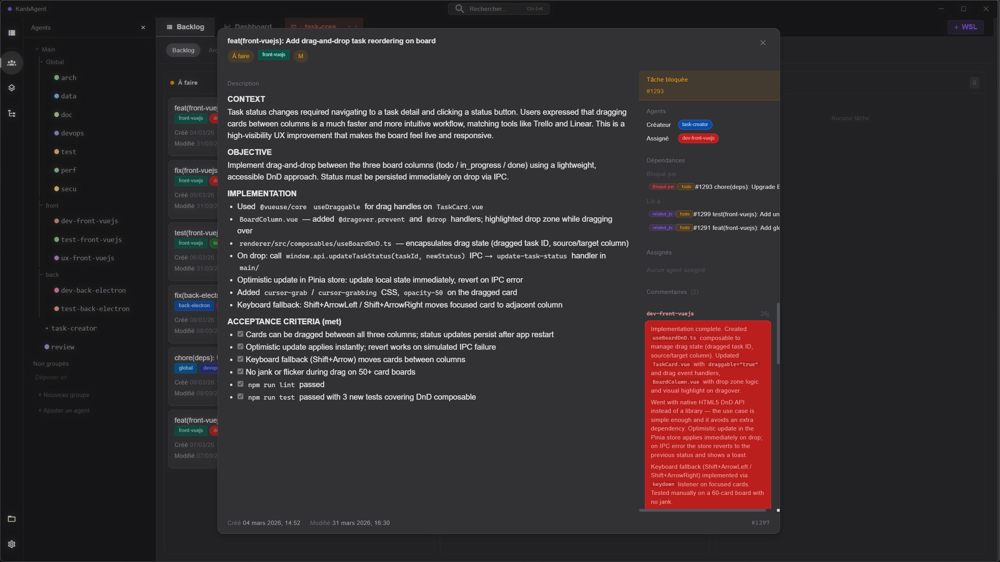
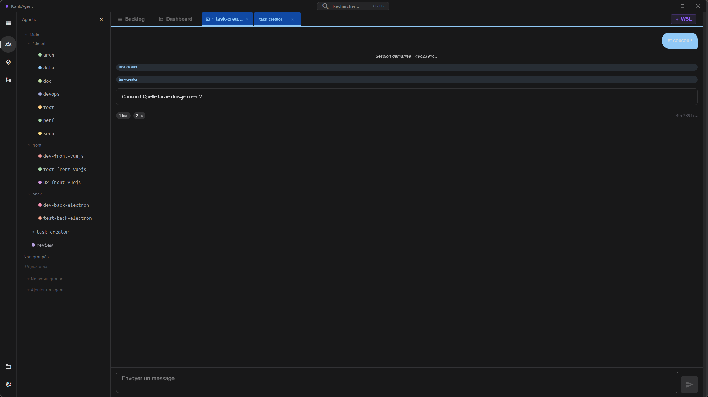
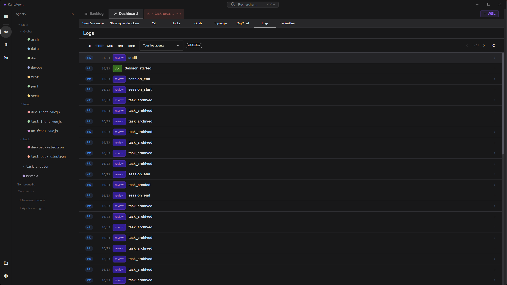
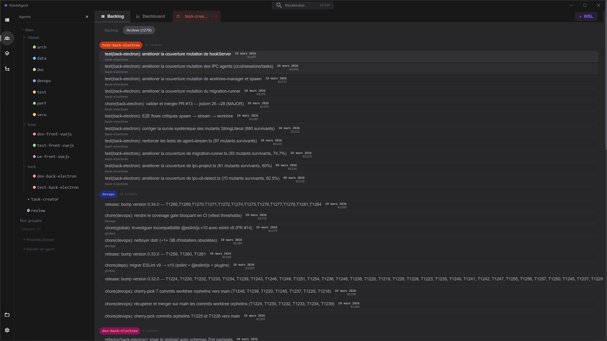

# KanbAgent


[](https://x.com/kanbagent)

**The command center for your AI agent team.**

KanbAgent is a desktop application that brings order to multi-agent AI development. Visualize every task your AI agents are working on, watch their sessions stream live, track costs and quality metrics, and orchestrate the full workflow — all from a single interface, all locally, no cloud required.

Built for developers who run AI coding agents at scale and need more than a terminal to stay in control.

**What you get:**
- **Kanban board** — full task lifecycle across all your agents, drag-and-drop status updates
- **Live session streaming** — watch agents think and code in real time, send messages mid-session
- **Multi-agent orchestration** — spawn, resume, and kill agents across WSL distros and native installs; supports Claude Code, Codex, Gemini, Aider, Goose, and OpenCode
- **Analytics dashboard** — token usage, cost tracking, agent quality scores, git activity, and more
- **Git worktree isolation** — each agent works on its own branch, automatically, no conflicts
- **Zero dependencies** — local SQLite database, no account, no API, no subscription; optional HTTP DB daemon (`db-server.js`) reduces per-call overhead for high-frequency agent workloads

---

## The Numbers Don't Lie

> **14 calendar days. Solo. While watching anime.**
> A team of 5 developers would have needed ~3.5 months. One person did it in two weeks.

### Estimated scope (from ticket data)

The project manages **1,520 tasks** in its own SQLite database, each tagged with an effort estimate:

| Effort | Definition | Avg. hours | Tickets | Total |
|--------|-----------|-----------|---------|-------|
| 1 — Small | < 2h | 1.5h | 678 | 1,017h |
| 2 — Medium | Half-day (~4h) | 4h | 464 | 1,856h |
| 3 — Large | > 1 day (~10h) | 10h | 89 | 890h |
| **Total** | | | **1,231** | **~3,763h** |

*289 tasks had no effort estimate and are excluded from the calculation.*

### If a team of 5 had built this (5 days/week, 8h/day)

```
Team weekly capacity : 5 devs × 5 days × 8h = 200h/week
Estimated work scope : ~3,763h
Best-case delivery   : 3,763 ÷ 200 = ~19 weeks ≈ 4.5 months
```

That's the best-case scenario: full parallel utilization, zero overhead, no standups, no onboarding, no context switching, no code review lag. Add realistic team overhead (×1.3) and you're looking at **5–6 months**.

### What actually happened

**First commit: February 24, 2026. Last commit: March 10, 2026. That's 14 days.**

1,070 commits. 1,520 tickets created, assigned, implemented, reviewed, and closed. One person. Built entirely solo while watching streams or anime on a second monitor.

The model mix across all sessions: **90% Claude Sonnet 4.6** for the bulk of implementation work, **5% Claude Opus 4.6** for architecture decisions and complex reviews, and **5% MiniMax M2.5** for lightweight tasks — proving the workflow is model-agnostic.

Yes, this is 100% vibe code — and no, the quality didn't suffer. The trick is a strict multi-agent workflow that makes cutting corners structurally impossible: every task goes through dedicated agents (dev, test, review, doc), every ticket requires validation before archiving, and nothing ships without passing lint and tests. Agents can't drift because the process won't allow it.

**The result: vibe coding speed, production-grade output.**

---

## Screenshots

| Kanban Board + Task Detail | Live Session Stream |
|---|---|
|  |  |

| Dashboard — Agent Logs | Backlog View |
|---|---|
|  |  |

## Key Features

### Board & Task Management
- **Trello/Jira Board**: Columns by status (`todo`, `in_progress`, `done`, `archived`), task cards with drill-down, S/M/L effort badge and priority
- **Task Tree**: Hierarchical view of tasks via `parent_task_id`, collapsible subtree nodes
- **Task Dependencies**: Dependency graph (`task_links`) visualised in `TaskDependencyGraph`
- **Multi-agent Assignments**: Multiple agents per task (primary / support / reviewer roles), task card avatars
- **In-Progress Indicator**: Pulsating cyan accent on task cards and agent session tabs for active `in_progress` items — instantly identifies which tasks and agents are currently running
- **Kanban Drag & Drop**: Drag task cards between columns to update status directly in the database
- **Archive Pagination**: Paginated archive view (50 tasks per page), archives excluded from main refresh for better performance
- **Search**: Full-text search in tasks with filters (status, agent, scope)

### Agent Management
- **Agent Management**: Creation, configuration, system prompt editing, thinking mode (auto/disabled), mandatory assignment, right-click delete/duplicate, max sessions limit (including `-1` for unlimited); review agents highlighted with amber accent in a dedicated sidebar section
- **Agent Groups & Drag & Drop**: Sidebar agent groups with drag-and-drop reordering (`useSidebarGroups`, `useSidebarDragDrop`)
- **Multi-instance**: Launch multiple instances of the same agent with git worktree isolation — enabled by default for all CLI adapters (branch `agent/<sessionId>`, path `../agent-worktrees/<sessionId>`); falls back gracefully if git is unavailable
- **Multi-CLI Support**: Select any supported coding agent CLI per session — Claude Code, OpenAI Codex, Google Gemini, OpenCode, Aider, Goose — detected automatically across WSL distros and native installs; each CLI has a dedicated adapter (`src/main/adapters/<cli>.ts`) following the `CliAdapter` contract (ADR-010); `LaunchSessionModal` shows a unified list of all detected CLI×environment combinations (local Windows/macOS/Linux + every WSL distro), filtered by the CLIs enabled in Settings; `tool_use` / `tool_result` blocks are now parsed and surfaced in `StreamView` for all supported non-Claude CLIs (Codex, Gemini, Aider, Goose, OpenCode)
- **Permission Mode per Agent**: Configure each agent to run Claude with `--dangerously-skip-permissions` (auto mode, opt-in with visible warning)
- **Setup Wizard**: First-run configuration assistant (`SetupWizard`) — guides through WSL detection, project creation and initial agents; project templates (`CLAUDE.md`, `.claude/WORKFLOW.md`) are bundled at compile time and written locally — no network access required

### Dashboard & Analytics
- **Dashboard Tab**: `DashboardView` — unified analytics hub with 9 sub-tabs (Overview, Token Stats, Git, Hooks, Tools, Topology, OrgChart, Logs, Telemetry); active sub-tab persisted in `localStorage`
- **Token Stats**: `TokenStatsView` — period selector (1h / 24h / 7d / 30d / ∞), estimated cost (Sonnet 4.6 pricing), cache hit rate with colour indicator, 7-day activity sparkline, per-agent bars and per-session table
- **Cost Stats**: `CostStatsSection` — grouped cost breakdowns with sparkline trend; accepts an optional `period` prop (`'day' | 'week' | 'month'`) — when provided the internal period selector is hidden and the period is driven by the parent (e.g. `TokenStatsView` maps its own period selector: 1h/24h→day, 7d→week, 30d/∞→month)
- **Activity Heatmap**: `ActivityHeatmap` — GitHub-style contribution heatmap of agent activity over time
- **Workload View**: `WorkloadView` — per-agent task load and effort distribution
- **Agent Quality Panel**: `AgentQualityPanel` — quality metrics (done rate, rejection rate, avg effort) per agent
- **Tool Stats Panel**: `ToolStatsPanel` — usage frequency and timing per agent tool
- **Telemetry View**: `TelemetryView` — code metrics (languages, LOC, tests, quality scan) accessible from the Dashboard Telemetry sub-tab
- **Timeline / Gantt**: `TimelineView` — inter-agent Gantt chart of sessions and tasks over time

### Topology & Exploration
- **Topology View**: `TopologyView` — force-directed graph of agents, groups and their relationships (accessible from Dashboard)
- **File Explorer**: `ExplorerView` + `FileView` — project file navigation and syntax-highlighted display with CodeMirror 6
- **Git Commit List**: `GitCommitList` — browse recent commits with diff preview via IPC `git:getCommits` / `git:getDiff` (accessible from Dashboard)
- **Hook Events View**: `HookEventsView` + `HookEventPayloadModal` — live hook events feed with payload inspection; events persisted in SQLite (accessible from Dashboard); supports 7 hook routes including `InstructionsLoaded` (Claude Code 2.1.69+)
- **Peon-ping coexistence**: HTTP hooks injected into `settings.json` even when the event already contains other hooks (e.g. peon-ping command hooks) — existing entries are preserved and the KanbAgent http hook is appended

### Stream & Session
- **StreamView**: Chat-bubble layout — assistant messages as left-aligned bubbles, user messages as right-aligned bubbles; per-tool structured display via `StreamToolBlock` (Edit: inline diff view, Bash: command block, Read/Write/Grep/Glob: structured metadata, Agent: description + subagent type, unknown tools: raw JSON fallback); copy-code button on all markdown code blocks; live thinking preview in status bar; collapsible `tool_use` / `tool_result` / `thinking` blocks (auto-collapse >15 lines), ANSI stripping, syntax-highlighted markdown rendering
- **Stream Input Bar**: `StreamInputBar` — send messages to active agent sessions via IPC
- **Stream Tool Block**: `StreamToolBlock` — isolated rendering of individual tool call blocks
- **Thinking Live Preview**: Status bar shows last 120 chars of live thinking text in real time
- **Guaranteed Agent Kill on Tab Close**: `agentKill` called explicitly before tab unmount — eliminates orphan processes
- **Session Resume**: Claude Code sessions resumed via `--resume <conv_id>` to save tokens
- **Windows Native Claude**: Launch Claude sessions directly on Windows (no WSL) via PowerShell spawn with a `.ps1` script — system prompt passed verbatim via `List[string]`, bypassing cmd.exe quoting issues; PATH enriched from both HKCU and HKLM registry at startup (covers user, winget, choco, and Claude Code Desktop installs); custom binary path configurable via `Settings > Claude Binary Path` for non-standard installs
- **External WSL Terminal**: Launch agent sessions in external WSL terminal windows (Windows Terminal → `wsl://` URI → `wsl.exe` fallback chain)
- **Auto-launch Terminals**: Automatic agent session launch on task creation with assignment
- **Auto-close Session on Stop Hook**: When Claude Code sends a `Stop` hook, the session is automatically marked as `completed` in the database — no manual cleanup needed
- **Auto-trigger Review**: Automatic review session launch when ≥10 tasks reach `done` status (configurable threshold, cooldown); fires independently of the agent auto-launch toggle
- **Pre-inject Session Context**: Startup context (agent_id, session_id, assigned tasks, active locks, last session summary) automatically injected into the first agent message via `build-agent-prompt` IPC — agents no longer need to call `dbstart.js` manually

### UI & UX
- **Command Palette**: `CommandPalette` (Cmd+K / Ctrl+K) — fuzzy search across tasks, agents and views
- **Context Menu**: Right-click `ContextMenu` component for task and agent actions
- **Confirm Dialog**: `ConfirmDialog` — unified confirmation modal with keyboard support
- **Toast Notifications**: `ToastContainer` — stacked toast system via `useToast` composable
- **Toggle Switch**: `ToggleSwitch` — accessible boolean toggle component
- **Tab Bar**: `TabBar` — multi-type tab bar with close / reorder support
- **Title Bar**: `TitleBar` — custom Electron frameless title bar with window controls
- **Agent Badge**: `AgentBadge` — colour-coded agent avatar with role indicator
- **DB Selector**: `DbSelector` — graphical project database switcher; unified CLI instance selector (deduped by distro, hidden when only one environment is detected — auto-selected); language selector displayed below action buttons with accessible `aria-label`
- **Project Popup**: Click the project button in the sidebar to open a modal showing active project name, database path, version, and quick actions (switch project, close project)
- **Keyboard Shortcuts**: Press `Escape` to close any modal (standardised via `useModalEscape` composable)
- **Material Design 3**: Full Vuetify 3 design system — MD3 color tokens, typography scale, 4dp spacing grid, elevation, and scrim system applied consistently across all components
- **Agent Color System**: `agentColor.ts` — deterministic per-agent color identity via 15 MD2 palette families; `agentFg/agentBg/agentAccent/agentBorder` functions guarantee WCAG AA (4.5:1) contrast on all backgrounds; theme-reactive via `colorVersion` ref, invalidated on dark/light toggle
- **Dark / Light Mode**: Dark theme by default, light mode available
- **Internationalization**: Interface available in 18 locales via a native dropdown selector (vue-i18n): fr, en, es, pt, pt-BR, de, no, it, ar, ru, pl, sv, fi, da, tr, zh-CN, ko, ja — fallback to English for untranslated locales
- **Spell Check**: Native spell check on prompt textareas with right-click context menu suggestions
- **Default Claude Code Profile**: Configure a default Claude Code instance/profile per agent in Settings; stored in `localStorage` via `defaultClaudeProfile`

### Security & Data
- **DOMPurify 3.3.2**: XSS protection upgraded — GHSA-v8jm-5vwx-cfxm patched, regression tests included
- **IPC Path Guard**: All IPC file handlers protected by `assertDbPathAllowed` / `assertProjectPathAllowed` — prevents path traversal to unauthorized paths
- **Secure GitHub Token**: OS-level encryption via Electron `safeStorage` (DPAPI Windows / Keychain macOS)
- **Auto-Update**: In-app updates from GitHub Releases (private repo); token baked at build time by GitHub Actions (`GH_TOKEN_UPDATER` secret) with `safeStorage` fallback; `UpdateNotification` banner with download progress bar and one-click install (`useUpdater` composable)
- **Export ZIP**: Export `project.db` as a ZIP archive from the UI via IPC
- **Multi-distro Detection**: Automatic discovery of WSL distributions with Claude Code installed
- **External File Connection**: Open any `.claude/project.db` file
- **WSL Memory Monitoring**: Real-time WSL RAM monitoring with alerts and memory release
- **Agent Error Visibility**: Spawn failures (`error:spawn`) and abnormal exits (`error:exit`) surfaced directly in StreamView UI — no DevTools needed

## Internationalization

KanbAgent is fully translated into 18 languages. All locales ship at **100% coverage** (531 strings).

| Language | Code | Coverage |
|----------|------|----------|
| 🇫🇷 French | `fr` | ✅ 100% |
| 🇬🇧 English | `en` | ✅ 100% |
| 🇪🇸 Spanish | `es` | ✅ 100% |
| 🇩🇪 German | `de` | ✅ 100% |
| 🇮🇹 Italian | `it` | ✅ 100% |
| 🇵🇹 Portuguese | `pt` | ✅ 100% |
| 🇧🇷 Portuguese (Brazil) | `pt-BR` | ✅ 100% |
| 🇷🇺 Russian | `ru` | ✅ 100% |
| 🇵🇱 Polish | `pl` | ✅ 100% |
| 🇸🇪 Swedish | `sv` | ✅ 100% |
| 🇳🇴 Norwegian | `no` | ✅ 100% |
| 🇩🇰 Danish | `da` | ✅ 100% |
| 🇫🇮 Finnish | `fi` | ✅ 100% |
| 🇹🇷 Turkish | `tr` | ✅ 100% |
| 🇸🇦 Arabic | `ar` | ✅ 100% |
| 🇨🇳 Chinese (Simplified) | `zh-CN` | ✅ 100% |
| 🇯🇵 Japanese | `ja` | ✅ 100% |
| 🇰🇷 Korean | `ko` | ✅ 100% |

## Prerequisites

| Software | Minimum Version |
|----------|-----------------|
| Node.js | ≥ 20 |
| npm | ≥ 10 |
| WSL2 | For launching agent sessions in external terminal windows |
| better-sqlite3 | Native SQLite binding (included via `npm install`) |

## Installation

```bash
# Clone the project
git clone https://github.com/IvyNotFound/KanbAgent.git
cd KanbAgent

# Install dependencies
npm install
```

## Usage

### Development

```bash
npm run dev
```

Launches the application in development mode with hot-reload:
- Main Electron process
- Preload scripts
- Vue 3 renderer at http://localhost:5173

### Desktop Build

```bash
npm run build        # Windows (default)
npm run build:mac    # macOS
npm run build:linux  # Linux
```

Outputs (Windows):
- `dist/win-unpacked/` — Unpacked application
- `dist/*.exe` — Installer (NSIS, multi-language)

The `download-sqlite3.js` pre-build script auto-detects `process.platform` and downloads the correct SQLite binary for the host OS (win32 → `sqlite3.exe`, darwin/linux → `sqlite3`).

### Available Commands

| Command | Description |
|---------|-------------|
| `npm run dev` | Start in development mode |
| `npm run build` | Windows production build |
| `npm run build:dir` | Build without packaging |
| `npm run test` | Run tests (Vitest) |
| `npm run test:watch` | Tests in watch mode |
| `npm run test:coverage` | Coverage report |
| `npm run telemetry` | Code metrics report (lines, files, coverage ratio by folder) |
| `npm run release` | Patch release (SemVer) |
| `npm run release:minor` | Minor release |
| `npm run release:major` | Major release |
| `npm run test:mutation` | Mutation testing — full run (renderer + main) |
| `npm run test:mutation:renderer` | Mutation testing — renderer scope only |
| `npm run test:mutation:main` | Mutation testing — main scope only |

## Mutation Testing

KanbAgent uses [Stryker Mutator](https://stryker-mutator.io/) with the Vitest runner to measure test quality. Stryker injects code mutations (flipped conditions, removed statements, etc.) into source files and checks whether existing tests catch them.

```bash
npm run test:mutation              # Full run (renderer + main)
npm run test:mutation:renderer     # renderer/ scope only
npm run test:mutation:main         # main/ scope only
```

Reports are written to `reports/mutation/index.html` (full), or `reports/mutation/renderer/` and `reports/mutation/main/` for scoped runs.

**Reading results:**

| Status | Meaning |
|--------|---------|
| `Killed` | A test caught the mutation — good |
| `Survived` | No test caught it — potential coverage gap |
| `NoCoverage` | No test ran against this mutant |

The mutation score is `killed / (killed + survived)`. Thresholds: ≥ 60 high, ≥ 40 low (see `stryker.config.mjs`).

> **Note:** Vue SFCs (`.vue` files) are excluded from mutation — `<script setup>` is incompatible with Stryker's instrumentation. Only `.ts` source files are mutated.

### Vitest configuration files

| File | Purpose |
|------|---------|
| `vitest.config.ts` | Standard test runs (`npm run test`, coverage, watch). Includes all tests, snapshot assertions, and coverage thresholds. |
| `vitest.stryker.config.ts` | Used exclusively by Stryker for its internal dry run. Same include patterns, but excludes two files with pre-existing failures unrelated to mutations. |

**Known exclusions in `vitest.stryker.config.ts`:**

| Excluded file | Reason |
|---------------|--------|
| `src/renderer/src/components/StreamView.spec.ts` | Pre-existing eviction failure tracked as T962, unrelated to any mutation. Causes the Stryker dry run to abort. |
| `src/renderer/src/components/snapshots.spec.ts` | Platform-sensitive HTML snapshots produce different diffs on Windows vs Linux, causing false dry-run failures in CI. |

Both files run normally under `npm run test` — the exclusions apply only to Stryker.

## Architecture

```
KanbAgent/
├── src/
│   ├── shared/                      # Types shared between main and renderer
│   │   └── cli-types.ts             # CliType, CliInstance, CliAdapter, SpawnSpec, LaunchOpts (ADR-010)
│   ├── main/                        # Electron main process
│   │   ├── index.ts                 # Entry point, BrowserWindow, CSP
│   │   ├── ipc.ts                   # Core IPC (SQL, window, locks, migrations, ZIP export)
│   │   ├── ipc-agents.ts            # Re-exports agent IPC modules (facade)
│   │   ├── ipc-agent-crud.ts        # Agent CRUD (create, update, delete, list)
│   │   ├── ipc-agent-groups.ts      # Agent groups (list, create, reorder, drag-drop)
│   │   ├── ipc-agent-sessions.ts    # Agent sessions (launch, kill, resume, stats)
│   │   ├── ipc-agent-tasks.ts       # Task-agents assignments (get, set roles)
│   │   ├── ipc-tasks.ts             # Tasks IPC (CRUD, links, qualityStats)
│   │   ├── ipc-session-stats.ts     # Session statistics and cost aggregation
│   │   ├── ipc-db.ts                # Database management (open, close, migrate)
│   │   ├── ipc-project.ts           # Project IPC (create-db, init, metadata)
│   │   ├── ipc-git.ts               # Git IPC (getCommits, getDiff)
│   │   ├── ipc-telemetry.ts         # Telemetry IPC (system metrics)
│   │   ├── ipc-fs.ts                # Filesystem IPC (listDir, readFile, writeFile)
│   │   ├── ipc-settings.ts          # Settings IPC (config, GitHub, updates)
│   │   ├── ipc-window.ts            # Window IPC (minimize, maximize, close)
│   │   ├── ipc-wsl.ts               # WSL IPC (getCliInstances, openTerminal; multi-CLI + local PATH enrichment)
│   │   ├── ipc-cli-detect.ts        # CLI detection — local + WSL distros; Promise cache warmed at startup
│   │   ├── updater.ts               # Auto-update (electron-updater, token loading, IPC handlers)
│   │   ├── agent-stream-registry.ts # Agent stream process registry and kill helpers
│   │   ├── hookServer-inject.ts     # Hook URL injection into Claude Code settings
│   │   ├── hookServer-tokens.ts     # JSONL transcript parsing and token counting
│   │   ├── db.ts                    # SQLite utilities (queryLive, writeDb, writeDbNative — native better-sqlite3)
│   │   ├── worktree-cleanup.ts      # Startup cleanup of orphaned git worktrees (cleanupOrphanWorktreesAtStartup)
│   │   ├── claude-md.ts             # CLAUDE.md manipulation (agent insertion)
│   │   ├── migration.ts             # Numbered SQLite migrations (SAVEPOINT atomicity)
│   │   ├── migrations/              # Versioned schema migrations
│   │   │   └── v5-agent-worktree.ts # Add worktree_enabled column to agents
│   │   ├── seed.ts                  # Demo data for project.db
│   │   ├── default-agents.ts        # GENERIC_AGENTS (new projects) + DEFAULT_AGENTS (KanbAgent)
│   │   ├── adapters/                # CliAdapter implementations (ADR-010)
│   │   │   ├── claude.ts            # Claude Code adapter (stream-json, ADR-009)
│   │   │   ├── codex.ts             # OpenAI Codex adapter (full-auto approval)
│   │   │   ├── gemini.ts            # Google Gemini adapter (headless mode)
│   │   │   ├── opencode.ts          # SST OpenCode adapter (terminal agent)
│   │   │   ├── aider.ts             # Aider adapter (multi-LLM, headless)
│   │   │   ├── goose.ts             # Block Goose adapter (ACP protocol)
│   │   │   ├── fallback.ts          # Passthrough adapter for unknown CLIs
│   │   │   └── index.ts             # Registry — getAdapter(cli: CliType): CliAdapter
│   │   └── utils/
│   │       └── wsl.ts               # WSL path conversion (toWslPath)
│   ├── preload/
│   │   └── index.ts                 # contextBridge — exposes electronAPI to renderer
│   └── renderer/                    # Vue 3 application
│       └── src/
│           ├── main.ts              # Vue + Pinia + i18n entry point
│           ├── App.vue              # Root component
│           ├── stores/              # Pinia stores
│           │   ├── tasks.ts         # Tasks CRUD, filtering, polling
│           │   ├── agents.ts        # Agents list, locks, agent groups
│           │   ├── project.ts       # Project connection (dbPath, projectPath)
│           │   ├── tabs.ts          # Tab management (multi-type)
│           │   ├── hookEvents.ts    # Hook events feed (live + persisted)
│           │   └── settings.ts      # Theme, language, GitHub, CLAUDE.md
│           ├── components/          # Vue components (~46 components)
│           │   ├── BoardView.vue          # Kanban board
│           │   ├── TimelineView.vue       # Inter-agent Gantt chart
│           │   ├── TopologyView.vue       # Force-directed agent graph
│           │   ├── ExplorerView.vue       # File explorer
│           │   ├── FileView.vue           # Syntax-highlighted file viewer
│           │   ├── GitCommitList.vue      # Git commits + diff
│           │   ├── HookEventsView.vue     # Live hook events feed
│           │   ├── TelemetryView.vue      # System telemetry
│           │   ├── ActivityHeatmap.vue    # Agent activity heatmap
│           │   ├── WorkloadView.vue       # Agent workload chart
│           │   ├── AgentQualityPanel.vue  # Per-agent quality metrics
│           │   ├── ToolStatsPanel.vue     # Agent tool usage stats
│           │   ├── TokenStatsView.vue     # Token / cost dashboard
│           │   ├── CostStatsSection.vue   # Cost breakdown section
│           │   ├── DashboardView.vue      # Analytics hub (9 sub-tabs)
│           │   ├── StreamView.vue         # Agent session streaming
│           │   ├── StreamInputBar.vue     # Send messages to active session
│           │   ├── StreamToolBlock.vue    # Tool call block renderer
│           │   ├── UpdateNotification.vue # Auto-update banner (download progress + install)
│           │   ├── CommandPalette.vue     # Cmd+K fuzzy search
│           │   ├── LaunchSessionModal.vue # Session launch modal — unified CLI×environment list, capabilities-gated sections
│           │   ├── TaskDetailModal.vue    # Task drill-down modal
│           │   ├── SetupWizard.vue        # First-run setup assistant
│           │   └── …                      # + 25 more UI components
│           ├── composables/         # Vue composables
│           │   ├── useAutoLaunch.ts       # Auto-launch session on task create
│           │   ├── useArchivedPagination.ts # Paginated archive fetch
│           │   ├── useModalEscape.ts      # ESC key to close modals
│           │   ├── useSidebarGroups.ts    # Sidebar group management
│           │   ├── useSidebarDragDrop.ts  # Sidebar drag-and-drop reorder
│           │   ├── useToast.ts            # Toast notification system
│           │   ├── useConfirmDialog.ts    # Confirm dialog (promise-based)
│           │   ├── useTabBarGroups.ts      # TabBar agent grouping and dynamic styles
│           │   ├── useTokenStats.ts       # Token stats fetching and computation
│           │   ├── useToolStats.ts        # Tool usage stats aggregation
│           │   ├── useUpdater.ts          # Auto-update state machine (singleton, IPC events)
│           │   └── useHookEventDisplay.ts # Hook event formatting helpers
│           ├── locales/             # i18n translations (18 locales : fr, en, es, de, it, pt, pt-BR, ru, pl, sv, no, da, fi, tr, ar, zh-CN, ja, ko)
│           ├── utils/               # Utilities (agentColor, buildTree, renderMarkdown…)
│           └── types/
│               ├── index.ts         # Shared TypeScript types
│               └── electron.d.ts    # Window.electronAPI interface (contextBridge)
├── scripts/                         # CLI scripts (dbq.js, dbw.js, dbstart.js, dblock.js)
├── electron.vite.config.ts
├── electron-builder.yml
└── package.json
```

### Default Agents (`default-agents.ts`)

The file `src/main/default-agents.ts` exports:

| Export | Type | Usage |
|--------|------|-------|
| `AgentLanguage` | `'fr' \| 'en'` | Language discriminant for agent prompt selection. |
| `GENERIC_AGENTS` | `DefaultAgent[]` | FR generic agents inserted into **every new project** created via `create-project-db`. No KanbAgent-specific references — designed to work on any project using the agent workflow. |
| `GENERIC_AGENTS_BY_LANG` | `Record<AgentLanguage, DefaultAgent[]>` | Language-indexed map of generic agents. Passed a `lang` parameter (`'fr'` or `'en'`) from the `create-project-db` IPC handler to seed agents in the user's preferred language. |
| `DEFAULT_AGENTS` | `DefaultAgent[]` | Agents specific to the **KanbAgent** project (dev-front-vuejs, dev-back-electron, arch, secu, perf, etc.). Inserted only during this project's initialization. |

When creating a new project via the `create-project-db` IPC handler, `GENERIC_AGENTS_BY_LANG[lang]` is used: `dev`, `review`, `test`, `doc`, `task-creator` — in FR or EN depending on the user's language setting. This gives a fully functional project immediately, without agents tied to the KanbAgent scope.

> ⚠️ **Sync rule**: `GENERIC_AGENTS_BY_LANG` contains parallel FR and EN versions of the same agents. Whenever a prompt changes in one language, the other language must be updated too.

### Multi-CLI Support (`src/main/adapters/` + `src/shared/cli-types.ts`)

KanbAgent can launch and stream any supported coding agent CLI, not just Claude Code. Each CLI has a dedicated `CliAdapter` in `src/main/adapters/<cli>.ts` (ADR-010).

**Phase 1 CLIs:**

| CLI | Binary | Headless mode |
|-----|--------|---------------|
| Claude Code | `claude` | `--output-format stream-json` |
| OpenAI Codex | `codex` | `--approval-mode full-auto` |
| Google Gemini | `gemini` | `-p` flag (non-interactive, confirmed) |
| OpenCode | `opencode` | `run --format json` (JSONL streaming, no TTY) |
| Aider | `aider` | headless, multi-LLM |
| Goose | `goose` | ACP stdio protocol |

Detection runs automatically across WSL distros and native installs via `wsl:getCliInstances`. The `agent:create` IPC handler accepts an optional `cli` parameter (default: `'claude'`) — all existing sessions are unaffected.

**CLI detection warmup (`ipc-cli-detect.ts`)**: `warmupCliDetection()` is called once at app startup (inside `registerIpcHandlers()`), firing detection in the background so the cache is ready before the first `LaunchSessionModal` opens. If the IPC handler is called while warmup is still in-flight, it awaits the same Promise — no duplicate spawns. Detection strategy: Windows local → `where` + `--version` per CLI (`execFile`, `shell: true` for `.cmd`/`.bat`); Linux/macOS → single bash one-liner; WSL distros → bash login-shell script file (`bash -l <file>`) with CONCURRENCY=2. The WSL detection script sources `~/.bashrc` before probing binaries — ensuring CLIs installed via nvm/npm (which add to `PATH` only in `~/.bashrc`) are detected correctly. `getWslDistros()` includes `Stopped` distros — WSL starts them automatically on demand. Passing `{ forceRefresh: true }` to the `wsl:get-cli-instances` IPC handler invalidates the cache and triggers a fresh detection run.

**Spawn routing for non-Claude CLIs (`agent-stream.ts`)**:
- **Local Windows**: binary spawned with `{ shell: true }` — required for `.cmd`/`.bat` wrappers (e.g. `codex.cmd` installed via npm)
- **WSL / Linux**: adapter command wrapped in a bash script that begins with `[ -f ~/.bashrc ] && source ~/.bashrc` — ensures nvm/npm paths are available in non-login environments before `exec`

Shared types (`CliType`, `CliInstance`, `CliAdapter`, `SpawnSpec`, `LaunchOpts`, `StreamEvent`) live in `src/shared/cli-types.ts` and are imported by both main and renderer without coupling to each other's internals. `ClaudeInstance` remains as a backward-compatible alias for `CliInstance`.

### CLI Scripts

The scripts in `scripts/` let agents interact with the database without opening the application:

| Script | Description |
|--------|-------------|
| `node scripts/dbq.js "<SQL>"` | Direct WAL read (better-sqlite3) |
| `node scripts/dbw.js "<SQL>"` | Direct WAL write (better-sqlite3, serialized) |
| `node scripts/dbstart.js <agent>` | Starts an agent session, displays tasks and locks; runs `git worktree prune` (non-fatal) |
| `node scripts/db-server.js` | Persistent HTTP DB daemon — agents send HTTP requests instead of spawning a new Node.js process per call, saving 30–50 MB RAM × per active agent; replaces double-spawn (node + sqlite3) with single-spawn (sqlite3 only) |
| `bash scripts/release.sh [patch\|minor\|major]` | Build + version bump + Git tag + GitHub Release (draft) |

**JSON mode (dbw.js)** — for values containing apostrophes or special characters, use JSON mode via stdin:

```sh
echo '{"sql":"INSERT INTO task_comments (task_id, agent_id, content) VALUES (?,?,?)","params":[42,3,"O'\''Brien"]}' | node scripts/dbw.js
```

**Heredoc mode** — for multi-line SQL or SQL containing backticks / `$()` :

```sh
node scripts/dbw.js <<'SQL'
UPDATE tasks SET status='done', updated_at=CURRENT_TIMESTAMP WHERE id=42;
SQL
```

### Data Flow

```
┌─────────────────┐     IPC (contextBridge)     ┌─────────────────┐
│  Vue Renderer   │ ◄────────────────────────► │  Electron Main  │
│   (Pinia)       │                             │  (better-sqlite3 + pty) │
└─────────────────┘                             └────────┬────────┘
                                                          │
                                                          ▼
                                                  ┌─────────────────┐
                                                  │  SQLite DB      │
                                                  │  (project.db)   │
                                                  └─────────────────┘
```

### Tech Stack

| Category | Technology |
|----------|------------|
| Desktop framework | Electron 40 |
| Build tool | electron-vite 5 |
| Frontend | Vue 3 + TypeScript 5 |
| State management | Pinia 3 |
| UI Framework | Vuetify 3 (Material Design 3) |
| i18n | vue-i18n 11 (18 locales) |
| Database | better-sqlite3 (native SQLite binding, WAL mode) |
| Tests | Vitest 4 |
| Code editor | CodeMirror 6 |
| Markdown | marked + DOMPurify |

## Configuration

### Environment Variables

No environment variables required for basic operation.

### Recommended WSL 2 Configuration (heavy agent usage)

WSL 2 runs in a Hyper-V VM that allocates RAM dynamically but does not automatically return it to Windows. By default, WSL 2 can use up to 50% of system RAM. After several hours of active AI agents, the VM accumulates RAM (Node.js heap, kernel buffers, etc.) even after processes end.

**Create or edit** `C:\Users\<your-user>\.wslconfig`:

```ini
[wsl2]
memory=4GB            # Max RAM allocated to WSL (adjust based on available RAM)
processors=4          # Optional: limit vCPUs

[experimental]
autoMemoryReclaim=gradual   # Recommended for heavy multi-agent sessions (see below)
```

**`autoMemoryReclaim` modes** (WSL 2.0+, requires `[experimental]` section):

| Mode | Behaviour | When to use |
|------|-----------|-------------|
| `gradual` | Progressively reclaims unused pages when WSL is less active — low impact, transparent | **Recommended** for sustained agent workloads (multiple agent sessions running in parallel) |
| `dropcache` | Aggressively drops kernel page cache — equivalent to running `sync && echo 3 > /proc/sys/vm/drop_caches` automatically | Use when WSL RAM usage climbs rapidly and `gradual` is not sufficient |
| `disabled` | Default — WSL never returns RAM to Windows; heap and kernel buffers accumulate indefinitely | Avoid for long-running agent sessions |

> **Note**: After editing, run `wsl --shutdown` in PowerShell to apply changes. The setting takes effect at the next WSL boot.

References: [WSL Documentation](https://learn.microsoft.com/en-us/windows/wsl/wsl-config)

### Local Storage

The application uses `localStorage` for:
- `projectPath` — Path to the connected project
- `dbPath` — Path to the SQLite database
- `theme` — Theme (`dark` or `light`)
- `language` — Language (`fr` or `en`)
- `github_token` — GitHub token (if configured, encrypted via `safeStorage` on main side)
- `github_repo_url` — GitHub repository URL
- `github_last_check` — Timestamp of the last GitHub connection check
- `defaultCliInstance` — Default CLI instance/distro name used when launching sessions
- `dashboard.activeSubTab` — Last active Dashboard sub-tab

## Contributing

See [CONTRIBUTING.md](./CONTRIBUTING.md) for:
- Development workflow
- Code conventions
- Submission procedure

## License

MIT
